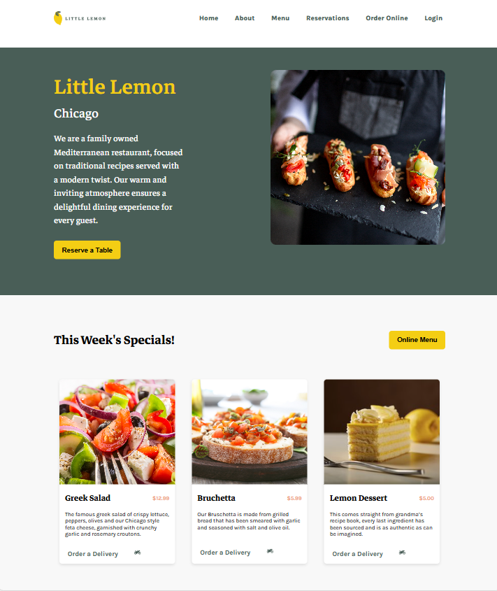

 Coursera Project
  # Capstone-Project - Little Lemon Restaurant

This is a solution to the [Little Lemon Restaurant Capstone Project on Coursera](https://www.coursera.org/learn/meta-front-end-developer-capstone/home/module/1). Coursera Projects help you improve your coding skills  by building realistic projects. 

## Table of contents

- [Overview](#overview)
  - [The challenge](#the-challenge)
  - [Screenshot](#screenshot)
  - [Links](#links)
- [My process](#my-process)
  - [Built with](#built-with)
  - [What I learned](#what-i-learned)
  - [Continued development](#continued-development)
  - [Useful resources](#useful-resources)
- [Author](#author)
- [Acknowledgments](#acknowledgments)

## Overview

### About The Project

A web app for Little Lemon Restaurant- Build this web app  in React and use all of the excellent tools available. Putting  newly acquired skills into practice,  demonstrate how to build and program part of a responsive web app. 

It includes the following elements:

A home screen with information about the restaurant.

A table reservation system.

A profile screen for users to enter their personal details.

Navigation that enables users to move between parts of the web app.

### Screenshot

### Links

- Solution URL: [https://github.com/manjubhaskar02/LittleLemon](https://github.com/manjubhaskar02/LittleLemon)
- Live Site URL: [https://manjubhaskar02.github.io/LittleLemon/#/LittleLemon](https://manjubhaskar02.github.io/LittleLemon/#/LittleLemon)

## My process

### Built with

- Semantic HTML5 markup
- CSS custom properties
- React
### What I learned

I’ve just finished my coding journey on the Meta front-end developer program. By the end of this program, we can put our new skills to work by completing a real-world portfolio project, where we can create our own dynamic front-end web application. Completing this project will help us to validate the knowledge and skills that we have gained.

### Continued development

Want to focus on react more.
## Author
Manju Bhaskar - https://github.com/manjubhaskar02

## Acknowledgments

I would like to express my deepest gratitude to my husband, Safaldas, whose constant encouragement and unwavering support have been the driving force behind my journey. His belief in me has pushed me to take on challenges I never thought possible.

I am also incredibly thankful to my mentor, Sneha, for her invaluable guidance and wisdom. Her insights have been instrumental in shaping my growth and success.

A special thanks to GitHub and Coursera for providing platforms that have made learning and development so accessible. Lastly, my heartfelt appreciation goes to ChatGPT for its assistance, which has been a vital resource throughout this journey.

